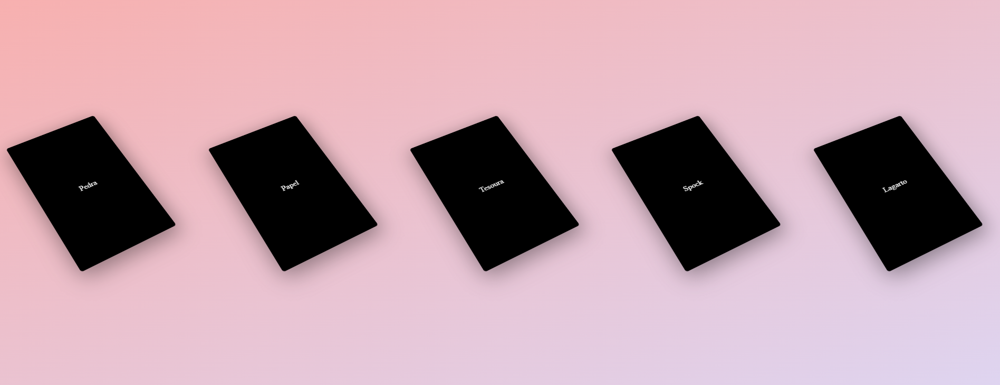

# 📇 Sistema de Gerenciamento de Cards

Este projeto é um sistema desenvolvido em **PHP** com integração ao **MySQL**, incluindo **criptografia de senhas** para garantir maior segurança dos usuários.

## 📌 Sobre o Projeto
Este sistema implementa o jogo “Pedra, Papel, Tesoura, Lagarto, Spock”, versão estendida do clássico Jokenpo, popularizada pela série The Big Bang Theory.
Diferente do Jokenpo tradicional, esta variação inclui duas jogadas adicionais — Lagarto e Spock — criando um conjunto maior de possibilidades e regras.

O projeto foi desenvolvido em PHP, utilizando orientação a objetos, integração com MySQL (se aplicável), além de boas práticas de organização e estruturação do código.

### ⚙️ Tecnologias Utilizadas
- **PHP** (backend)
- **MySQL** (banco de dados)
- **Criptografia de senha** usando `password_hash()` e `password_verify()`
- HTML/CSS/JS (interface)

---

## 🖼️ Interface

Abaixo, uma prévia dos cards exibidos pelo sistema:



---

## ▶️ Como Executar

1. **Clone o repositório:**
   ```bash
   git clone https://github.com/RuyOllivere/Jokenpo-The-Big-Bang-Theory.git
   cd Jokenpo-The-Big-Bang-Theory
